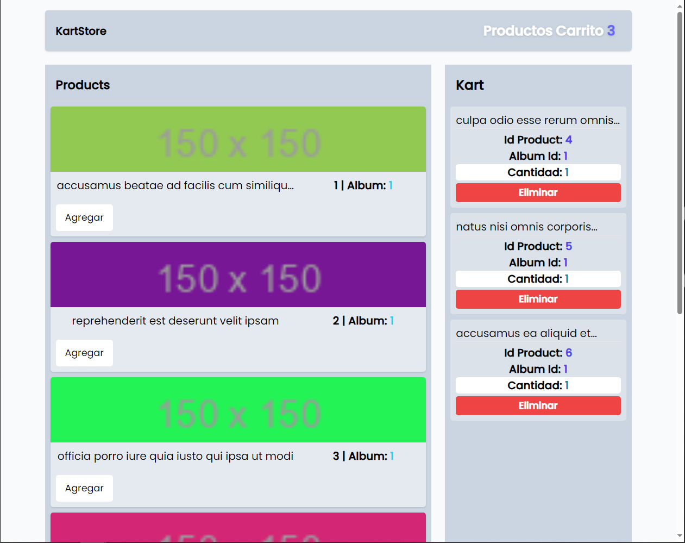

## Pinia
Es una manejador de Estado central en VueJS

- Contiene soporte a devtools
- Facilita la depuración del código
- Se renderizan los cambios de forma automática
- Soporte de la comunidad

## App de Prueba con Pinia
Este pequeño proyecto me ha permitido acercarme más al control de estado con VueJS. En esta ocasión _Pinia_, el cual ofrece una flexibilidad de uso para _Options API_ o haciendo uso del paradigma _Composition API_.

Cabe resaltar que en esta investigación y aprendizaje kinestésico no he encontrado la manera de hacer uso del _Store de Pinia_ con un componente que use _Options API_.

En este proyecto he tomado datos de Ejemplo de _JSON Placeholder_ y he hecho uso de _TailwindCSS_ además del eje principal del proyecto.

La dinámica del proyecto consiste en un carrito de compras en donde se van almacenando los elementos agregados en el _Store global de Pinia_ y tomando estos datos para _computar_ una propiedad que calcular en cada cambio la cantidad de elementos agregados.

